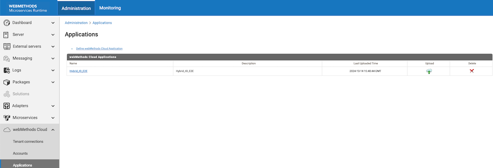

# WxCloud

This package shows how to automate the creation and upload of WmCloud application and services for MSR



## Prerequisites

This assumes that Tenant alias and Account alias has been created. Which could be automated using accounts.cnf, coneections.cnf & application.properties
in MSR

## Installation

Install using wpm

example command: wpm.sh install -r custom_ibm WxCloud

## Usage 

In your docker file
1. Copy the accounts.cnf to <Instalation>/IntegrationServer/config/integrationLive/ 
2. Copy the accounts.cnf to <Instalation>/IntegrationServer/config/integrationLive/ 
3. Copy the application.properties
4. Install WxCloud using wpm (using above command)

## Input 

The sample config [wmcloud_application.json](./config/wmcloud_application.json) has the necessary details for application creation and configuration.


## Sample / example

### accounts.cnf
```xml
<?xml version="1.0" encoding="UTF-8"?>

<IDataXMLCoder version="1.0">
  <record javaclass="com.wm.data.ISMemDataImpl">
    <record name="default" javaclass="com.wm.data.ISMemDataImpl">
      <value name="alias">default</value>
      <jboolean name="isEnabled">true</jboolean>
      <value name="username">gitops</value>
      <value name="pswdHandle">wm.is.admin.ilive.gitops.default</value>
      <value name="iLiveURL">https://dummy.webmethods.io</value>
      <value name="umURL">nhps://dummy.um.int-aws-de.webmethods.io:443//dummy/</value>
  </record>
  </record>
</IDataXMLCoder>
```

### connections.cnf
```xml
<?xml version="1.0" encoding="UTF-8"?>

<IDataXMLCoder version="1.0">
  <record javaclass="com.wm.data.ISMemDataImpl">
    <array name="IntegrationLiveConnections" type="record" depth="1">
      <record javaclass="com.wm.data.ISMemDataImpl">
        <value name="tenantAlias">default</value>
        <value name="aliasName">Hybrid_IPaaS</value>
        <value name="description"></value>
        <value name="stage">stage00</value>
        <value name="stageDisplay">Development</value>
        <value name="onPremiseHosts">localhost</value>
        <number name="windowSize" type="java.lang.Integer">5</number>
        <number name="retry" type="java.lang.Long">5</number>
        <value name="runAsUser">Administrator</value>
        <jboolean name="isEnabled">true</jboolean>
        <jboolean name="isForAdminUse">false</jboolean>
        <record name="properties" javaclass="com.wm.data.ISMemDataImpl">
        </record>
      <number name="timeToLive" type="java.lang.Long">60001</number>
      <number name="timeToLiveCache" type="java.lang.Long">30</number>
      </record>
    </array>
  </record>
</IDataXMLCoder>
```

### application.properties
#Sample Generated Template
#Thu Jun 27 14:24:12 GMT 2024

wmcloudsettings.default.iLiveURL=https\://dummy.int-aws-de.webmethods.io

wmcloudsettings.default.password="AES Password generated from IS"

wmcloudsettings.default.username=gitops

wmcloudaccount.Hybrid_IPaaS.stage=stage00

## Contribute

This is an open-source project and requires community contributions to remain useful. Anyone can contribute to the project in the following ways:
1. Fork this repository.
2. Make your enhancements/ changes.
3. Create a Pull Request.
4. Finally, development team will evaluate the Pull Request and merge it to the source code.

## Issues / Bugs

In case of Bugs, please create an issue with following details
1. Version
2. Detailed description (with images if needed)
3. Error stacktace (log snippets)

## Disclaimer
### IBM Public Repository Disclosure
All content in these repositories including code has been provided by IBM under the associated open source software license and IBM is under no obligation to provide enhancements, updates, or support. IBM developers produced this code as an open source project (not as an IBM product), and IBM makes no assertions as to the level of quality nor security, and will not be maintaining this code going forward.

